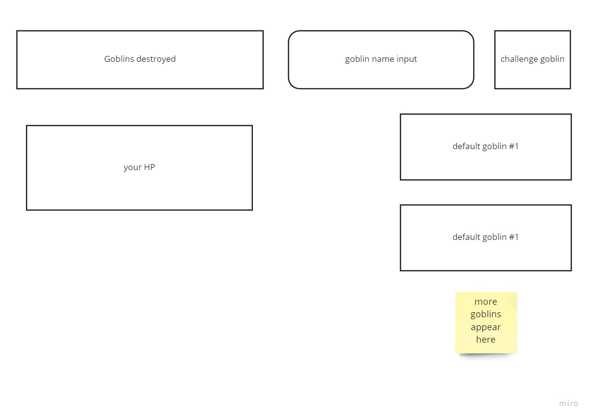

## The Golden Rule: 

🦸 🦸‍♂️ `Stop starting and start finishing.` 🏁

If you work on more than one feature at a time, you are guaranteed to multiply your bugs and your anxiety.

## Making a plan

1) **Make a drawing of your app. Simple "wireframes"** 

1) **Look at the drawing and name the HTML elements you'll need to realize your vision**
[] goblins destroyed div
[] goblin name input
[] challenge goblin button
[] HP div
[] goblin area div
[] generated goblin divs

1) **Look at the drawing and imagine using the app. What _state_ do you need to track?**
[] goblins destroyed
[] goblins generated
[] HP

1) **For each HTML element ask: Why do I need this? (i.e., "we need div to display the results in")** 
- to display how many goblins destroyed
- for user to name their goblins
- to create a new goblin
- to display how many HP remaining
- area for goblins
- to display each individual goblin

1) **Once we know _why_ we need each element, think about how to implement the "Why" as a "How" (i.e., `resultsEl.textContent = newResults`)**
- click listener on each goblin updates goblins destroyed if goblin dies
- input
- click listener to generate goblin
- goblin click chooses at random to damage HP
- just a div
- challenge goblin button appends new goblins to goblin area div

1) **Find all the 'events' (user clicks, form submit, on load etc) in your app. Ask one by one, "What happens when" for each of these events. Does any state change? Does any DOM update?**
- on load: create default goblins, default HP, goblins destroyed 0
- challenge goblin button click
- click goblin to fight

1) **Think about how to validate each of your features according to a Definition of Done. (Hint: console.log usually helps here.)**
- goblins destroyed div should update when goblin reaches 0 hp
- challenge goblin button should create a new goblin object in the goblin area with the name from the input area
- HP should decrease after goblin successfully hits / similarly for goblin HP
- goblin should appear after clicking challenge goblin

1) **Consider what features _depend_ on what other features. Use this dependency logic to figure out what order to complete tasks.**

Additional considerations:
- Ask: which of your HTML elements need to be hard coded, and which need to be dynamically generated?
- Consider your data model. 
  - What kinds of objects (i.e., Dogs, Friends, Todos, etc) will you need? 
  - What are the key/value pairs? 
  - What arrays might you need? 
  - What needs to live in a persistence layer?
- Is there some state we need to initialize?
- Ask: should any of this work be abstracted into functions? (i.e., is the work complicated? can it be resused?)
